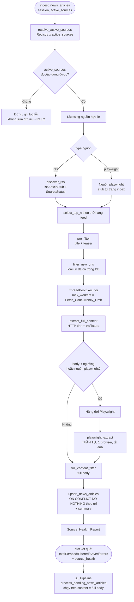
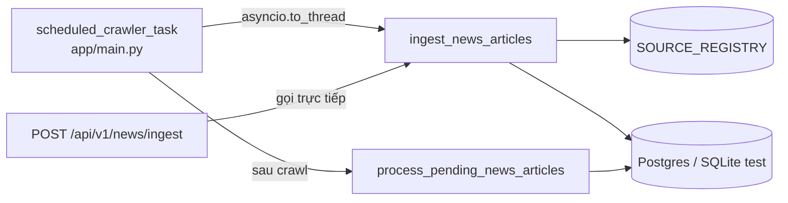
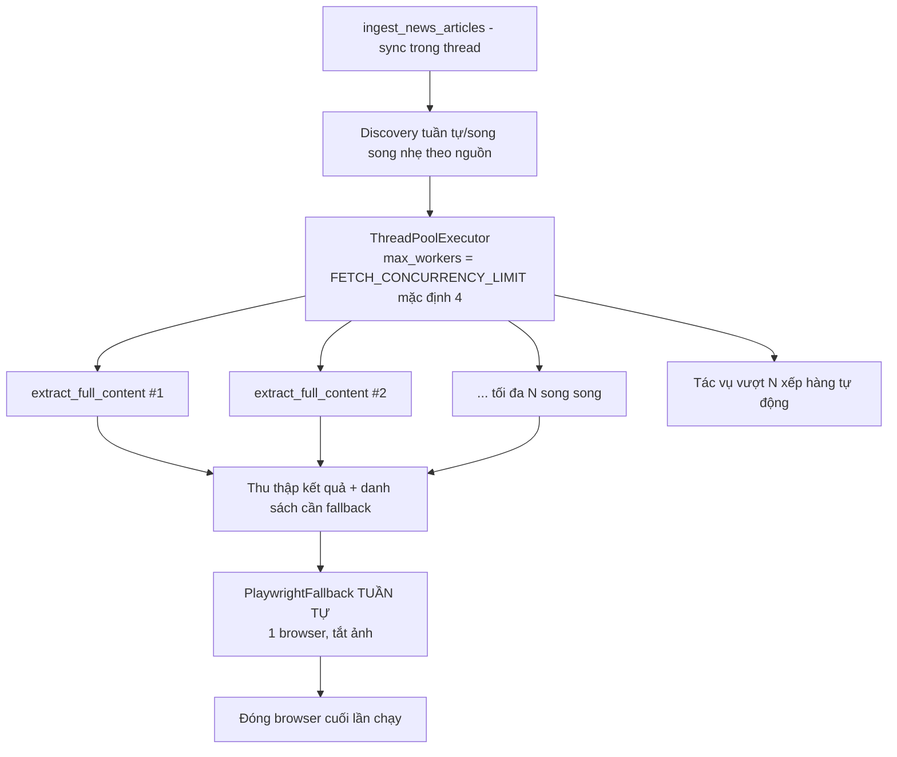

# Tài liệu Thiết kế: news-crawler-fulltext

## Overview

Tài liệu này mô tả thiết kế nâng cấp luồng thu thập tin tức của quantyFin-ai-agent từ chỗ chỉ lấy teaser RSS (`<description>`) lên thu thập "bài viết thật sự" gồm tiêu đề, `summary` (teaser) và `content` (full body). Thiết kế áp dụng kiến trúc 3 tầng (RSS Discovery → Content Extractor → Playwright Fallback) với cơ chế lọc hai giai đoạn, chống trùng lặp, báo cáo sức khỏe nguồn, và kiểm soát chặt tài nguyên cho server 2 CPU / 2 GB RAM.

Thiết kế bám sát codebase hiện có: FastAPI + Python 3.11, `httpx.Client` đồng bộ, SQLModel + Postgres (test dùng SQLite in-memory qua `conftest.py`), logging JSON với `trace_id_var`, migration thủ công idempotent trong `init_db()` (không dùng Alembic), crawl chạy đồng bộ trong thread qua `asyncio.to_thread`.

### Ánh xạ thiết kế với 13 Requirements

| Requirement | Thành phần thiết kế chịu trách nhiệm |
|---|---|
| R1 — Source Registry tập trung | `app/services/sources/registry.py`: `SourceConfig`, `SOURCE_REGISTRY`, `load_sources()`, `resolve_active_sources()`. `SUPPORTED_SOURCES_MAP` ở `settings.py` suy ra từ registry. |
| R2 — RSS Discovery | `app/services/extraction/rss.py`: `discover_rss()` + ánh xạ HTTP/parse → `SourceStatus`. |
| R3 — Xếp hạng Top/Hot theo chủ đề | `select_top_n()` trong orchestrator + `topics`/`top_n` trong `SourceConfig`. |
| R4 — Lọc hai giai đoạn + dedup | `pre_filter()`, `full_content_filter()`, `filter_new_urls()`. |
| R5 — Content Extractor HTTP tĩnh | `app/services/extraction/content.py`: `extract_full_content()` (trafilatura). |
| R6 — Playwright Fallback có điều kiện | `app/services/extraction/playwright_fallback.py`: `playwright_extract()` tuần tự. |
| R7 — Schema `summary` + migration | Cột `summary` trong `NewsArticle` + migration idempotent trong `init_db()`. |
| R8 — Source Health Report + Jobs View | `app/services/health.py`: `SourceHealth`, tổng hợp trong `ingest_news_articles()`, trả qua `/ingest`. |
| R9 — Ràng buộc tài nguyên & song song | `ThreadPoolExecutor(max_workers=Fetch_Concurrency_Limit)` + Playwright tuần tự 1 browser. |
| R10 — Không nuốt lỗi & observability | `SourceHealth.error_message`, truyền `trace_id` vào worker, đánh dấu thất bại toàn phần. |
| R11 — Politeness | User-Agent cấu hình + rate limit per-site + timeout. |
| R12 — Upsert idempotent | `upsert_news_articles()` (giữ chữ ký, bổ sung `summary`). |
| R13 — Tương thích scheduler & AI pipeline | `ingest_news_articles(session, active_sources)` giữ chữ ký; `process_pending_news_articles` xử lý `content` rỗng/null. |

### Nguyên tắc thiết kế cốt lõi

1. **Tương thích ngược tuyệt đối**: Giữ nguyên chữ ký `ingest_news_articles(session, active_sources)` và `upsert_news_articles(session, articles)`; giữ nguyên các trường phản hồi hiện có của `/ingest` (R13.6).
2. **Đồng bộ trong thread**: Pipeline chạy sync, dùng `ThreadPoolExecutor` cho I/O song song; KHÔNG chuyển sang async toàn cục.
3. **Không nuốt lỗi**: Mọi lỗi nguồn đều được ghi vào Source_Health_Report; một nguồn lỗi không làm dừng các nguồn khác.
4. **Tiết kiệm tài nguyên**: Playwright là tầng cuối, chạy tuần tự, 1 browser, tắt ảnh, đóng sau mỗi lần chạy.

## Architecture

### Sơ đồ pipeline 3 tầng



### Vị trí trong hệ thống hiện có



Pipeline AI **không đổi vị trí**: vẫn chạy sau crawl trong scheduler và qua `POST /process-ai`. Sau nâng cấp, `article.content` chứa full body nên AI pipeline tự động hưởng lợi mà không cần đổi chữ ký; chỉ bổ sung xử lý `content` rỗng/null (R13.5).

### Phân lớp module

| Lớp | Module | Vai trò |
|---|---|---|
| Cấu hình nguồn | `app/services/sources/registry.py` (mới) | Khai báo nguồn, validate, resolve theo `active_sources`. |
| Discovery | `app/services/extraction/rss.py` (mới) | Đọc RSS → `ArticleStub` + `SourceStatus`. |
| Extraction | `app/services/extraction/content.py` (mới) | HTTP tĩnh + trafilatura. |
| Fallback | `app/services/extraction/playwright_fallback.py` (mới) | Playwright tuần tự. |
| Lọc | `app/services/extraction/filters.py` (mới) | `pre_filter`, `full_content_filter`. |
| Health | `app/services/health.py` (mới) | `SourceHealth`, tổng hợp report. |
| Politeness | `app/services/extraction/politeness.py` (mới) | `RateLimiter` per-site, User-Agent. |
| Orchestrator | `app/services/crawler.py` (sửa) | `ingest_news_articles`, `upsert_news_articles`, `select_top_n`, `filter_new_urls`. |

### File hiện có cần sửa

| File | Thay đổi |
|---|---|
| `app/models/news.py` | Thêm cột `summary: Optional[str]` (Text, nullable). |
| `app/main.py` | Thêm migration idempotent cột `summary` trong `init_db()`. |
| `app/services/crawler.py` | Viết lại orchestrator dùng registry + 3 tầng; giữ chữ ký hàm. |
| `app/api/v1/settings.py` | `SUPPORTED_SOURCES_MAP` suy ra từ registry. |
| `app/api/v1/news.py` | Bổ sung `sourceHealth` vào phản hồi `/ingest`. |
| `app/services/ai_pipeline.py` | Bỏ qua bài có `content` rỗng/null, gán trạng thái không xử lý được (R13.5). |
| `app/core/config.py` | Thêm tham số: `FETCH_CONCURRENCY_LIMIT`, `DEFAULT_TOP_N`, `MIN_CONTENT_LENGTH`, `FETCH_TIMEOUT`, `PER_SITE_RATE_LIMIT`, `CRAWLER_USER_AGENT`. |
| `pyproject.toml` | Thêm `trafilatura`, `playwright`. |

Các file `app/services/scrapers/*.py` và `SUPPORTED_SOURCES_MAP` hard-code được thay thế bằng registry. `BaseScraper.parse_rss` chứa logic parse XML hữu ích sẽ được tái sử dụng trong `discover_rss` (chuyển logic, không giữ class hierarchy).

## Components and Interfaces

### 1. Source Registry (R1)

```python
# app/services/sources/registry.py
from dataclasses import dataclass, field
from typing import Literal, Optional

SourceType = Literal["rss", "playwright"]
VALID_TOPICS = {"kinh tế", "kinh doanh", "đầu tư", "chứng khoán", "xã hội", "chính trị"}

@dataclass(frozen=True)
class SourceConfig:
    name: str               # duy nhất, 1..100 ký tự
    type: SourceType        # {"rss", "playwright"}
    url: str                # http/https
    topics: tuple[str, ...] # >= 1 topic, thuộc VALID_TOPICS
    tier: int               # 1..5
    top_n: Optional[int] = None  # None => dùng DEFAULT_TOP_N

# Danh sách khai báo tập trung (thay class scraper hard-code)
SOURCE_REGISTRY: list[SourceConfig] = [ ... ]

def validate_source(src: SourceConfig) -> Optional[str]:
    """Trả về None nếu hợp lệ, hoặc chuỗi mô tả lỗi (R1.7, R3.4)."""

def load_sources() -> tuple[dict[str, SourceConfig], list[str]]:
    """
    Nạp registry: validate từng nguồn, loại nguồn lỗi (R1.7),
    xử lý trùng tên dùng bản đầu tiên (R1.8).
    Trả về (map name->SourceConfig hợp lệ, danh sách warning/error).
    """

def resolve_active_sources(active_sources: str) -> tuple[list[SourceConfig], list[str]]:
    """
    Lọc registry theo chuỗi active_sources (R1.2, R13.1).
    Tên không tồn tại => warning + bỏ qua (R1.5).
    Trả về (danh sách nguồn cần chạy, danh sách warning).
    """

def supported_sources_map() -> dict[str, str]:
    """Suy ra SUPPORTED_SOURCES_MAP cho settings.py từ registry hợp lệ (R1)."""
```

`SourceConfig` dùng key chuẩn hóa (lowercase) để khớp `active_sources`; `name` là nhãn hiển thị lưu vào `NewsArticle.source`.

Tập nguồn khởi đầu đề xuất (URL cần xác nhận sống ở bước tasks — xem Error Handling):

| key | name | type | url (đề xuất) | topics | tier |
|---|---|---|---|---|---|
| cafef | CafeF | rss | `https://cafef.vn/thi-truong-chung-khoan.rss` | chứng khoán, kinh tế | 1 |
| tuoitre | TuoiTre | rss | `https://tuoitre.vn/rss/kinh-doanh.rss` | kinh doanh, kinh tế | 1 |
| thanhnien | ThanhNien | rss | `https://thanhnien.vn/rss/kinh-te.rss` | kinh tế, kinh doanh | 2 |
| vnbusiness | VnBusiness | rss | `https://vnbusiness.vn/rss/chung-khoan.rss` | chứng khoán, đầu tư | 2 |
| vnexpress_kd | VnExpressKinhDoanh | rss | `https://vnexpress.net/rss/kinh-doanh.rss` | kinh doanh, kinh tế | 1 |

Ghi chú: CafeF dùng đúng `https://cafef.vn/thi-truong-chung-khoan.rss` (KHÔNG có `/rss/`, khác với code hiện tại). NDH (`ndh.vn`) bị loại bỏ (domain chết). VnEconomy (`vneconomy.vn/rss/chung-khoan.rss` channel rỗng) và Vietstock (`vietstock.vn/rss/chung-khoan.rss` trả HTML) cần thay feed khác hoặc gắn type `playwright`; tạm để ngoài tập khởi đầu cho tới khi xác nhận. Registry cho phép bổ sung thêm feed kinh tế/kinh doanh/đầu tư/chứng khoán/xã hội/chính trị mà không sửa orchestrator (R1.6).

### 2. RSS Discovery (R2)

```python
# app/services/extraction/rss.py
from dataclasses import dataclass
import datetime as dt
import httpx
from app.services.health import SourceStatus

@dataclass
class ArticleStub:
    title: str
    url: str            # tuyệt đối
    teaser: str         # "" nếu thiếu
    published_at: dt.datetime
    source: str         # SourceConfig.name

def discover_rss(source: SourceConfig, client: httpx.Client) -> tuple[list[ArticleStub], SourceStatus]:
    """
    Tải và parse feed RSS của một nguồn type=rss.
    - Lấy tối đa 100 mục mới nhất theo thứ tự feed (R2.1).
    - Chuẩn hóa URL tuyệt đối (R2.3).
    - Bỏ mục thiếu title/url (R2.10).
    - Ánh xạ trạng thái: ok/empty/parse_error/dead/blocked (R2.4-R2.9).
    Không raise ra ngoài: mọi lỗi nguồn => trả ([], status tương ứng).
    """
```

Logic parse tái sử dụng từ `BaseScraper.parse_rss`/`clean_html`/`parse_pub_date` hiện có (chuyển vào module này). `client.get(url)` dùng `timeout=30.0`, `follow_redirects=True`.

### 3. Content Extractor (R5)

```python
# app/services/extraction/content.py
from dataclasses import dataclass
from typing import Optional
import httpx

@dataclass
class ExtractionResult:
    ok: bool
    body: str = ""                 # full body trích xuất được
    error: Optional[str] = None    # lý do thất bại (HTTP code / timeout / network)
    http_status: Optional[int] = None
    needs_fallback: bool = False   # True nếu body < MIN_CONTENT_LENGTH (R5.6)

def extract_full_content(url: str, client: httpx.Client) -> ExtractionResult:
    """
    Tải trang qua HTTP tĩnh (timeout cấu hình, mặc định 30s) và trích xuất
    full body bằng trafilatura (R5.1).
    - HTTP >= 400 => ok=False, error="http_<code>", không ghi đè dữ liệu (R5.4).
    - timeout/network error => ok=False, error="timeout"/"network" (R5.5, R11.5).
    - body < MIN_CONTENT_LENGTH => ok=True, needs_fallback=True (R5.6).
    """
```

### 4. Playwright Fallback (R6, R9)

```python
# app/services/extraction/playwright_fallback.py
from app.services.extraction.content import ExtractionResult

class PlaywrightFallback:
    """
    Worker tuần tự, dùng Playwright sync API. Tại mỗi thời điểm tối đa 1
    browser (R6.3, R6.4, R9.4, R9.5). Tắt tải ảnh (R6.5).
    """
    def __enter__(self) -> "PlaywrightFallback": ...   # mở 1 chromium
    def __exit__(self, *exc) -> None: ...              # đóng browser (R6.6, R9.6)

    def extract(self, url: str) -> ExtractionResult:
        """
        Lấy full body cho 1 bài, tối đa 1 lần thử (R6.2).
        - Quá 30s => hủy, error="timeout" (R6.6).
        - Lỗi xử lý => ok=False, error=... (R6.8).
        """
```

Toàn bộ tác vụ Playwright trong một lần chạy được xử lý **tuần tự bên ngoài ThreadPool** (sau khi pool HTTP hoàn tất), trong một context `with PlaywrightFallback() as pw:` duy nhất để đảm bảo chỉ 1 browser tồn tại và được đóng cuối lần chạy.

### 5. Bộ lọc (R4)

```python
# app/services/extraction/filters.py
def pre_filter(title: str, teaser: str, active_tickers: list[str]) -> bool:
    """Lọc nhẹ trên title + teaser trước khi tải full body (R4.1, R4.2)."""

def full_content_filter(title: str, body: str, active_tickers: list[str]) -> bool:
    """Lọc chính xác trên full body trước khi lưu (R4.7, R4.8)."""
```

Tái sử dụng `zero_cost_filter` hiện có làm nền (ticker + financial keyword). `pre_filter` chạy trên `title + teaser`; `full_content_filter` chạy trên `title + body`.

### 6. Dedup & Top-N (R3, R4, R12)

```python
# app/services/crawler.py
def select_top_n(stubs: list[ArticleStub], top_n: int) -> list[ArticleStub]:
    """Chọn min(top_n, len(stubs)) bài đầu danh sách theo thứ hạng feed (R3.2, R3.3)."""

def filter_new_urls(session: Session, stubs: list[ArticleStub]) -> list[ArticleStub]:
    """Loại các stub có url đã tồn tại trong NewsArticle (R4.3, R4.4, R4.5)."""
```

### 7. Politeness (R11)

```python
# app/services/extraction/politeness.py
class RateLimiter:
    """Giới hạn tần suất theo từng host (per-site), mặc định 1 req/s (R11.3, R11.4)."""
    def __init__(self, per_second: float = 1.0): ...
    def acquire(self, host: str) -> None:  # chặn cho tới khi được phép gửi
        ...
```

User-Agent lấy từ `settings.CRAWLER_USER_AGENT`; nếu rỗng dùng UA mặc định hệ thống (R11.1, R11.2).

### 8. Orchestrator (R8, R10, R13)

```python
# app/services/crawler.py
def upsert_news_articles(session: Session, articles: list[dict]) -> int:
    """
    GIỮ NGUYÊN chữ ký. Upsert idempotent theo url (R12).
    Bổ sung: mỗi dict có thể chứa 'summary' (teaser) cùng 'content' (full body).
    """

def ingest_news_articles(session: Session, active_sources: Optional[str] = None) -> dict:
    """
    GIỮ NGUYÊN chữ ký. Điều phối 3 tầng cho các nguồn trong active_sources.
    Trả về dict mở rộng:
      {
        "total_scraped": int, "total_filtered": int,
        "total_saved": int, "errors": dict,        # giữ nguyên (R13.6)
        "source_health": list[dict]                # MỚI (R8)
      }
    """
```

### 9. Endpoint `/ingest` (R13.6)

`POST /api/v1/news/ingest` giữ nguyên `totalScraped`, `totalFiltered`, `totalSaved`, `errors`; **chỉ bổ sung** trường `sourceHealth`:

```json
{
  "data": {
    "totalScraped": 42, "totalFiltered": 18, "totalSaved": 15,
    "errors": {},
    "sourceHealth": [
      {"source": "CafeF", "status": "ok", "articlesCount": 15,
       "durationMs": 1234, "errorMessage": null}
    ]
  },
  "error": null,
  "meta": {"trace_id": "..."}
}
```

Tùy chọn (nêu rõ là không bắt buộc): bổ sung `GET /api/v1/news/source-health` trả snapshot lần chạy gần nhất để Jobs_View truy vấn độc lập. Mặc định Jobs_View tiêu thụ `sourceHealth` trong phản hồi `/ingest` (R8.8).

## Data Models

### Cột `summary` trong NewsArticle (R7)

```python
# app/models/news.py — bổ sung MỘT cột, giữ nguyên các cột khác
class NewsArticle(SQLModel, table=True):
    __tablename__ = "news_articles"
    # ... các cột hiện có giữ nguyên ...
    content: str = Field(sa_column=Column(Text, nullable=False))   # = Full_Body
    summary: Optional[str] = Field(
        default=None, sa_column=Column(Text, nullable=True)        # = Teaser, NULL-able (R7.1, R7.4)
    )
    # sentiment_score, raw_entities, ... giữ nguyên
```

`content` lưu Full_Body; `summary` lưu Teaser. Ràng buộc độ dài 5.000 ký tự (R7.1) áp dụng ở tầng ghi (cắt teaser trước khi lưu), dùng `Text` để an toàn cả Postgres và SQLite.

### Migration idempotent trong init_db (R7.2, R7.5, R7.7)

Theo đúng pattern hiện có (kiểm tra cột tồn tại trước khi `ALTER TABLE`), KHÔNG dùng Alembic:

```python
# app/main.py :: init_db() — bổ sung trong khối migration news_articles
if "news_articles" in inspector.get_table_names():
    columns = [col["name"] for col in inspector.get_columns("news_articles")]
    needs = [c for c in ["sentiment_score", "raw_entities", "raw_relationships",
                         "resolved_entities", "resolved_relationships", "summary"]
             if c not in columns]
    if needs:
        with Session(engine) as session:
            try:
                # ... các ALTER hiện có ...
                if "summary" not in columns:
                    # TEXT hợp lệ trên cả Postgres và SQLite (R7.2)
                    session.execute(text("ALTER TABLE news_articles ADD COLUMN summary TEXT"))
                session.commit()                       # giữ content cũ (R7.3), bản ghi cũ summary=NULL (R7.4)
            except Exception as mig_err:
                session.rollback()                     # rollback toàn bộ (R7.5)
                logger.error(f"Migration news_articles thất bại: {mig_err}")  # báo lỗi rõ (R7.6)
                raise
    # nếu summary đã tồn tại => không vào nhánh ALTER => idempotent (R7.7)
```

Cột `summary` nullable nên bản ghi cũ tự động mang `NULL` sau migration (R7.4). Lệnh `ADD COLUMN summary TEXT` không đụng cột `content` (R7.3).

### Cấu trúc Source_Health_Report (R8)

```python
# app/services/health.py
from dataclasses import dataclass
from typing import Literal, Optional

SourceStatus = Literal["ok", "empty", "dead", "parse_error", "blocked"]  # R8.2

@dataclass
class SourceHealth:
    source: str
    status: SourceStatus
    articles_count: int          # >= 0 (R8.1)
    duration_ms: int             # >= 0 (R8.1)
    error_message: Optional[str] = None  # KHÔNG rỗng khi status != "ok" (R8.1, R10.1)

    def to_camel(self) -> dict:
        return {
            "source": self.source, "status": self.status,
            "articlesCount": self.articles_count, "durationMs": self.duration_ms,
            "errorMessage": self.error_message,
        }
```

### Ánh xạ HTTP/điều kiện → SourceStatus (R2.4–R2.9, R8.3–R8.7)

| Điều kiện | SourceStatus |
|---|---|
| Feed hợp lệ, ≥1 mục đủ title+url | `ok` |
| Feed XML hợp lệ, 0 mục | `empty` |
| Nội dung không phải XML hợp lệ (và HTTP < 400) | `parse_error` |
| HTTP 401 / 403 / 429 | `blocked` |
| Timeout 30s / không phân giải DNS / HTTP ≥ 400 ngoài {401,403,429} | `dead` |
| Vừa HTTP ≥ 400 vừa không phải XML | `dead` (ưu tiên dead — R2.7) |

### Tham số cấu hình mới (R3, R5, R9, R11)

| Tham số | Mặc định | Khoảng | Requirement |
|---|---|---|---|
| `FETCH_CONCURRENCY_LIMIT` | 4 | 1..10 | R9.2 |
| `DEFAULT_TOP_N` | (vd) 20 | 1..100 | R3.5, R3.7 |
| `MIN_CONTENT_LENGTH` | 500 | — | R5.6, R6.2, R6.7 |
| `FETCH_TIMEOUT` | 30s | 5..120 | R5.1, R11.5 |
| `PER_SITE_RATE_LIMIT` | 1.0 req/s | 0.1..10 | R11.3 |
| `CRAWLER_USER_AGENT` | UA hệ thống | — | R11.1, R11.2 |

## Correctness Properties

*Một property (thuộc tính) là một đặc tính hoặc hành vi phải luôn đúng trên mọi lần thực thi hợp lệ của hệ thống — về bản chất là một phát biểu hình thức về điều hệ thống phải làm. Properties là cầu nối giữa đặc tả dạng ngôn ngữ tự nhiên và các bảo đảm đúng đắn có thể kiểm chứng bằng máy.*

Phần lớn lõi nghiệp vụ của tính năng này là hàm thuần (validate registry, ánh xạ trạng thái, lọc, xếp hạng top-N, dedup, upsert) nên phù hợp với property-based testing. Các tiêu chí thuần wiring/UI/tài nguyên được phủ bằng unit/integration test (xem Testing Strategy). Sau bước reflection, các property trùng lặp đã được gộp.

### Property 1: Validate registry chỉ giữ nguồn hợp lệ

*Với mọi* danh sách khai báo nguồn (trộn nguồn hợp lệ và nguồn vi phạm ràng buộc: thiếu thuộc tính bắt buộc, `type` ngoài {rss, playwright}, `topics` rỗng hoặc chứa topic ngoài tập hợp lệ, `tier` ngoài 1..5, `name` rỗng hoặc > 100 ký tự), `load_sources()` chỉ giữ đúng các nguồn thỏa toàn bộ ràng buộc và sinh một cảnh báo/lỗi cho mỗi nguồn bị loại.

**Validates: Requirements 1.1, 1.7, 3.1, 3.4**

### Property 2: Trùng tên dùng bản đầu tiên

*Với mọi* registry có thể chứa các nguồn trùng `name`, kết quả `load_sources()` ánh xạ mỗi tên tới đúng một `SourceConfig` là bản xuất hiện đầu tiên theo thứ tự khai báo, và phát một cảnh báo cho mỗi tên trùng.

**Validates: Requirements 1.8**

### Property 3: Resolve active_sources là tập con của registry

*Với mọi* registry hợp lệ và *với mọi* chuỗi `active_sources` (gồm cả tên hợp lệ, tên rác, khoảng trắng thừa, chữ hoa/thường), `resolve_active_sources()` trả về danh sách nguồn mà mọi phần tử đều tồn tại trong registry và có key nằm trong `active_sources`; không tên rác nào xuất hiện trong kết quả, và mỗi tên rác sinh đúng một cảnh báo.

**Validates: Requirements 1.5, 13.1**

### Property 4: Ánh xạ điều kiện → SourceStatus là xác định

*Với mọi* kết quả truy cập feed (mã HTTP trong 200..599, cờ "nội dung là XML hợp lệ", số mục hợp lệ ≥ 0, cờ timeout/DNS-fail), hàm ánh xạ trạng thái trả về đúng một `SourceStatus` theo quy tắc: HTTP ∈ {401,403,429} → `blocked`; (timeout ∨ DNS-fail ∨ HTTP ≥ 400 ngoài {401,403,429}) → `dead` và quy tắc này ưu tiên hơn `parse_error` khi đồng thời xảy ra; nội dung không phải XML hợp lệ (HTTP < 400) → `parse_error`; XML hợp lệ với 0 mục → `empty`; XML hợp lệ với ≥ 1 mục đủ title+url → `ok`. Kết quả luôn thuộc tập {ok, empty, dead, parse_error, blocked}.

**Validates: Requirements 2.4, 2.5, 2.6, 2.7, 2.8, 2.9, 8.2, 8.3, 8.4, 8.5, 8.6, 8.7**

### Property 5: RSS Discovery giới hạn và làm sạch mục

*Với mọi* nội dung feed XML hợp lệ chứa n mục (trong đó một số mục có thể thiếu title hoặc url, hoặc thiếu teaser), `discover_rss()` trả về danh sách stub sao cho: độ dài ≤ 100; mọi stub có `title` và `url` khác rỗng (mục thiếu title/url bị loại); mọi stub có `teaser` là chuỗi (rỗng khi mục không có teaser); và thứ tự stub giữ nguyên thứ tự xuất hiện trong feed.

**Validates: Requirements 2.1, 2.10**

### Property 6: URL bài viết luôn được chuẩn hóa tuyệt đối

*Với mọi* feed có URL bài viết ở dạng tương đối hoặc tuyệt đối, mọi `ArticleStub.url` trả về từ `discover_rss()` đều là URL tuyệt đối (có scheme http/https).

**Validates: Requirements 2.3**

### Property 7: Chọn Top-N là tiền tố và bị chặn bởi min(top_n, len)

*Với mọi* danh sách stub và *với mọi* giá trị `top_n` (kể cả khi `top_n=None` thì dùng `DEFAULT_TOP_N`), `select_top_n()` trả về đúng `min(top_n_hiệu_dụng, len(stubs))` phần tử và kết quả là tiền tố của danh sách đầu vào (giữ thứ hạng theo thứ tự feed).

**Validates: Requirements 3.2, 3.3, 3.7**

### Property 8: Pre_Filter loại bài không thỏa tiêu chí

*Với mọi* danh sách stub và tập ticker hoạt động, tập bài được đưa vào bước tải full body là tập con của các stub thỏa `pre_filter(title, teaser)`; không stub nào có `pre_filter=False` lọt vào bước tải.

**Validates: Requirements 4.1, 4.2**

### Property 9: Full_Content_Filter chặn trước khi lưu

*Với mọi* danh sách bài đã có full body và tập ticker hoạt động, tập bài được đưa vào bước lưu là tập con của các bài thỏa `full_content_filter(title, body)`; không bài nào có `full_content_filter=False` được lưu.

**Validates: Requirements 4.7, 4.8**

### Property 10: Dedup loại URL đã tồn tại, giữ URL mới theo thứ tự

*Với mọi* tập URL đã có trong DB và *với mọi* danh sách stub, `filter_new_urls()` trả về đúng các stub có `url` không thuộc tập đã tồn tại, giữ nguyên thứ tự tương đối, và giao của kết quả với tập URL đã tồn tại là rỗng.

**Validates: Requirements 4.3, 4.4, 4.5**

### Property 11: needs_fallback theo ngưỡng độ dài

*Với mọi* chuỗi full body, `extract_full_content()` đặt `needs_fallback = True` khi và chỉ khi độ dài body nhỏ hơn `MIN_CONTENT_LENGTH`.

**Validates: Requirements 5.6**

### Property 12: Bài đã lưu luôn có content đủ dài

*Với mọi* lần chạy pipeline, mọi bài được lưu vào `NewsArticle` đều có `content` với độ dài ≥ `MIN_CONTENT_LENGTH`; bài có full body cuối cùng (sau cả Content_Extractor và Playwright_Fallback) ngắn hơn ngưỡng không bao giờ được lưu, và không lưu nội dung một phần.

**Validates: Requirements 6.7**

### Property 13: Upsert idempotent theo URL nguyên văn

*Với mọi* tập bài viết, sau khi gọi `upsert_news_articles()`: mỗi `url` xuất hiện đúng một lần trong DB; bài có `url` rỗng/thiếu bị loại; khi tập chứa nhiều bài cùng `url` chỉ bài xuất hiện đầu tiên được lưu; `url` chỉ khác nhau ở chữ hoa/thường được coi là khác nhau (không chuẩn hóa). Gọi lại `upsert_news_articles()` với cùng tập không tạo bản ghi mới và không ghi đè bản ghi hiện có (số bản ghi không đổi, lần hai `saved=0`).

**Validates: Requirements 12.1, 12.2, 12.3, 12.4**

### Property 14: Lưu summary round-trip và giới hạn độ dài

*Với mọi* bài viết có teaser, sau khi lưu rồi đọc lại, giá trị cột `summary` bằng teaser đã lưu (đã cắt còn tối đa 5.000 ký tự) và độc lập với cột `content`; độ dài `summary` lưu trữ luôn ≤ 5.000.

**Validates: Requirements 5.3, 7.1**

### Property 15: Bài mới lưu mang trạng thái pending

*Với mọi* bài mới được lưu qua `upsert_news_articles()` mà không chỉ định status, bản ghi nhận `status = "pending_entity_extraction"` để AI_Pipeline nhận diện là chưa phân tích.

**Validates: Requirements 13.3**

### Property 16: Bất biến của SourceHealth

*Với mọi* `SourceHealth` sinh ra trong một lần chạy: `status` thuộc {ok, empty, dead, parse_error, blocked}; `articles_count ≥ 0`; `duration_ms ≥ 0`; và nếu `status ≠ ok` thì `error_message` là chuỗi khác rỗng có chứa định danh nguồn.

**Validates: Requirements 8.1, 8.2, 10.1**

### Property 17: Báo cáo phản ánh mọi nguồn và cô lập lỗi

*Với mọi* tập nguồn đầu vào (kể cả khi một số nguồn ném lỗi trong quá trình xử lý), kết quả `ingest_news_articles()` có `source_health` với số phần tử bằng số nguồn được xử lý (lỗi một nguồn không làm dừng các nguồn khác), và khi mọi nguồn có `status ≠ ok` thì kết quả được đánh dấu thất bại toàn phần kèm danh sách trạng thái của các nguồn.

**Validates: Requirements 8.9, 10.3, 10.5**

### Property 18: Migration cột summary là idempotent

*Với mọi* số lần áp dụng migration liên tiếp trên cùng một bảng `news_articles`, kết quả schema ổn định (cột `summary` tồn tại đúng một lần) và không phát sinh lỗi từ lần áp dụng thứ hai trở đi.

**Validates: Requirements 7.7**

### Property 19: Rate limit per-site đảm bảo khoảng cách tối thiểu

*Với mọi* dãy yêu cầu tới cùng một host qua `RateLimiter.acquire(host)` với cấu hình `per_second`, khoảng cách thời gian giữa hai yêu cầu liên tiếp tới cùng host luôn ≥ `1 / per_second` (kiểm bằng đồng hồ giả lập).

**Validates: Requirements 11.3, 11.4**

## Error Handling

### Nguyên tắc: không nuốt lỗi, cô lập theo nguồn (R10)

- Mỗi nguồn được xử lý độc lập. Lỗi của một nguồn được chuyển thành `SourceHealth` với `status` phù hợp và `error_message` mô tả nguyên nhân kèm định danh nguồn (R10.1, R10.5); pipeline tiếp tục với các nguồn còn lại.
- `discover_rss()` và các hàm extraction **không raise ra ngoài** vòng lặp nguồn; chúng trả về kết quả + trạng thái. Riêng lỗi lưu DB ở `upsert_news_articles()` vẫn raise lên biên giao dịch như hiện tại (giữ hành vi `finding 6`/`E4`), nhưng được bao trong `try/except` để ghi vào `errors["db_save"]`.

### Ánh xạ lỗi → trạng thái

| Tình huống | Tầng | Xử lý |
|---|---|---|
| Timeout 30s khi tải RSS | RSS Discovery | `SourceStatus=dead`, error_message="timeout sau 30s" (R2.6, R8.5) |
| DNS không phân giải | RSS Discovery | `dead` (R2.6) |
| HTTP ≥ 400 ngoài {401,403,429} | RSS Discovery | `dead` (R2.6) |
| HTTP 401/403/429 | RSS Discovery | `blocked` (R2.9, R8.7) |
| Nội dung không phải XML hợp lệ | RSS Discovery | `parse_error` (R2.4, R8.6) |
| HTTP ≥ 400 **và** không XML | RSS Discovery | `dead` (ưu tiên, R2.7) |
| Feed hợp lệ, 0 mục | RSS Discovery | `empty` (R2.5, R8.4) |
| HTTP ≥ 400 khi tải trang bài | Content Extractor | `ExtractionResult.ok=False`, `http_status` set, không ghi đè (R5.4) |
| Timeout/network khi tải trang | Content Extractor | `ok=False`, `error∈{timeout,network}`, không ghi đè (R5.5, R11.5) |
| body < ngưỡng | Content Extractor | `needs_fallback=True` → Playwright (R5.6) |
| Playwright quá 30s | Playwright Fallback | hủy, `error=timeout` (R6.6) |
| Playwright lỗi xử lý | Playwright Fallback | `ok=False`, bài bị loại khỏi lưu (R6.8) |
| Sau Playwright body vẫn < 500 | Orchestrator | bài bị loại, không lưu một phần (R6.7) |
| Lưu một bản ghi thất bại | Upsert | dùng `begin_nested()` savepoint, giữ bài khác (R12.5) |
| `active_sources` không đọc/áp dụng được | Orchestrator | dừng lần chạy, ghi log lỗi, không sửa dữ liệu (R13.2) |
| `content` rỗng/null khi AI xử lý | AI Pipeline | bỏ qua phân tích, gán status không xử lý được, tiếp tục bài khác (R13.5) |

### Thất bại toàn phần (R10.3)

Nếu toàn bộ nguồn có `status ≠ ok`, kết quả trả về được đánh dấu thất bại toàn phần: orchestrator thêm cờ vào `errors` (vd `errors["all_sources_failed"]`) kèm danh sách `{source: status}`, thay vì báo thành công chung chung. `/ingest` vẫn trả HTTP 200 với dữ liệu phản ánh đúng trạng thái (client cũ đọc `errors`, client mới đọc `sourceHealth`).

### Trace_Id (R10.2, R10.4)

Tái dùng pattern hiện có: `parent_trace_id = trace_id_var.get()` ở orchestrator; mỗi worker trong `ThreadPoolExecutor` đặt `trace_id_var.set(parent_trace_id)` đầu hàm và `reset` ở `finally`, đảm bảo mọi log của lần chạy mang cùng `Trace_Id`.

### Xác nhận URL nguồn sống (ghi chú cho tasks)

URL trong registry khởi đầu cần được xác nhận sống ở bước tasks bằng một integration/smoke test gọi thật (hoặc kiểm thủ công), vì đây là sự thật về dịch vụ ngoài, không phải logic của hệ thống. CafeF đã xác minh `https://cafef.vn/thi-truong-chung-khoan.rss`; VnEconomy/Vietstock cần thay feed; NDH loại bỏ.

## Concurrency & Resource Model (R9, R11)

### Mô hình thực thi



- **Tải full body (HTTP)**: `ThreadPoolExecutor(max_workers=FETCH_CONCURRENCY_LIMIT)` (mặc định 4, khoảng 1..10). Các tác vụ vượt giới hạn được pool tự xếp hàng (R9.1–R9.3).
- **Playwright**: xử lý **tuần tự** sau khi pool HTTP hoàn tất, trong một context `with PlaywrightFallback()` mở đúng 1 chromium, tắt tải ảnh (chặn request resource type=image), đóng browser ở `__exit__` (R6.3–R6.6, R9.4–R9.6).
- **Rate limit per-site**: `RateLimiter` chặn theo host trước mỗi request HTTP/Playwright (mặc định 1 req/s) (R11.3, R11.4). Vì pool có nhiều worker, `RateLimiter` dùng khóa per-host an toàn luồng (threading.Lock + thời điểm cho phép tiếp theo theo host).

### Lựa chọn Playwright sync-in-thread và lý do

Codebase đồng bộ; `ingest_news_articles` chạy trong thread (qua `asyncio.to_thread`). Dùng **Playwright sync API** trong worker tuần tự là lựa chọn đơn giản và an toàn nhất:

- Tránh trộn async vào pipeline sync (giảm rủi ro deadlock/event-loop xung đột).
- Playwright sync API **không được phép chạy bên trong một event loop asyncio đang chạy**. Vì `ingest_news_articles` được gọi qua `asyncio.to_thread` (chạy trong thread riêng, KHÔNG có event loop), Playwright sync API hoạt động hợp lệ ở đó. Với endpoint `/ingest` (gọi trực tiếp trong handler async) cần chạy phần Playwright trong một thread riêng để tách khỏi event loop — đóng gói trong helper để cả hai lối gọi đều an toàn.
- Nếu sau này cần, có thể cô lập Playwright trong một event loop riêng bằng async API; nêu ở đây như phương án thay thế, không chọn cho bản đầu.

### Ước lượng bộ nhớ và biện pháp tránh OOM

- 1 chromium headless tắt ảnh ≈ 150–300 MB thường trực khi mở; mở/đóng theo từng lần chạy nên không tích lũy.
- 4 luồng HTTP + trafilatura (pure-python) ≈ vài chục MB mỗi luồng cho HTML lớn; tổng vài trăm MB đỉnh.
- **Cảnh báo OOM**: chạy nhiều browser song song trên 2 GB RAM dễ gây OOM — do đó Playwright bắt buộc tuần tự, tối đa 1 browser, và chỉ kích hoạt cho nguồn `type=playwright` hoặc khi Content_Extractor trả body < ngưỡng (mặc định, Playwright KHÔNG chạy cho phần lớn bài). Đóng browser ngay sau lần chạy để giải phóng RAM (R9.6).

## Testing Strategy

### Phương pháp kép

- **Property tests**: kiểm các thuộc tính phổ quát (Property 1–19), tối thiểu **100 vòng lặp** mỗi test.
- **Unit/Integration tests**: kiểm ví dụ cụ thể, edge case, wiring, và tài nguyên.

### Thư viện PBT

Dùng **Hypothesis** (chuẩn de-facto cho Python, tích hợp pytest sẵn có trong dự án). Không tự cài đặt PBT. Mỗi property test cấu hình `@settings(max_examples=100)` và gắn comment tham chiếu:

`# Feature: news-crawler-fulltext, Property {number}: {property_text}`

### Ánh xạ property → test

| Property | Mục tiêu test (Hypothesis) |
|---|---|
| 1, 2 | Sinh registry ngẫu nhiên (hợp lệ + vi phạm) → `load_sources()` |
| 3 | Sinh registry + `active_sources` → `resolve_active_sources()` |
| 4 | Sinh (mã HTTP, cờ XML, số mục, timeout/DNS) → hàm ánh xạ trạng thái |
| 5, 6 | Sinh feed XML (qua template) → `discover_rss()` với httpx mock |
| 7 | Sinh list stub + top_n → `select_top_n()` |
| 8, 9 | Sinh stub/bài + tickers → `pre_filter`/`full_content_filter` |
| 10 | Sinh existing urls + stubs → `filter_new_urls()` (SQLite) |
| 11 | Sinh body độ dài ngẫu nhiên → `extract_full_content()` (mock HTTP) |
| 12, 13, 14, 15 | Sinh tập article dict → `upsert_news_articles()` (SQLite) |
| 16, 17 | Sinh tập SourceHealth/nguồn mock (có nguồn lỗi) → orchestrator |
| 18 | Chạy migration nhiều lần → kiểm idempotent (SQLite) |
| 19 | `RateLimiter.acquire` với clock giả → kiểm khoảng cách |

### Unit/Integration test cho tiêu chí không-property

- **Registry/dispatch (1.2, 1.3, 1.4, 6.1)**: unit test routing type → tầng đúng.
- **Top_N range (3.5)**: edge test biên 1, 100, ngoài range.
- **RSS rỗng (3.6)**: nguồn trả [] → 0 fetch + log "no articles".
- **Content Extractor (5.1, 5.2, 5.4, 5.5)**: mock HTML/response → body, mã lỗi, timeout, network.
- **Playwright (6.2, 6.6, 6.8)**: mock Playwright → ≤1 lần thử, timeout, lỗi xử lý. **Test Playwright phải mock hoặc đánh dấu `@pytest.mark.skipif` khi chưa cài chromium trong CI**, tránh phụ thuộc môi trường.
- **Resource (9.x, 6.3–6.5)**: kiểm ThreadPool khởi tạo với `max_workers=FETCH_CONCURRENCY_LIMIT`; kiểm chỉ 1 browser + đóng cuối lần chạy.
- **Migration (7.2, 7.3, 7.4, 7.5, 7.6)**: SQLite — thêm cột, giữ content cũ, summary NULL, rollback khi lỗi, log nguyên nhân.
- **Politeness (11.1, 11.2)**: kiểm header User-Agent; rỗng → default.
- **AI compat (13.4, 13.5)**: seed bài `content=""`/NULL → bỏ qua phân tích + status không xử lý được; bài full body → chạy `run_extraction(content)`. Mock CrewAI như `conftest` đã làm.
- **Endpoint (13.6, 8.8)**: `POST /ingest` (TestClient) trả `totalScraped/totalFiltered/totalSaved/errors` + `sourceHealth`.
- **Cô lập lỗi (4.6, 12.5)**: mock một bài lỗi → bài khác vẫn xử lý/lưu.
- **Dừng khi config hỏng (13.2)**: mock đọc `active_sources` lỗi → 0 fetch, 0 thay đổi DB, log lỗi.
- **Trace_Id (10.2, 10.4)**: kiểm worker nhận `parent_trace_id`.

### Integration test end-to-end

Một integration test dựng feed RSS giả (XML tĩnh phục vụ qua httpx mock/transport), trang bài viết giả (HTML có thân bài đủ dài), chạy `ingest_news_articles()` trên SQLite in-memory và kiểm: bài được lọc → tải → lưu với `content` + `summary`, `source_health` đầy đủ, status `pending_entity_extraction`.

## Design Decisions & Rationale

### trafilatura vs readability

Chọn **trafilatura**: pure-python, nhẹ RAM, chất lượng trích xuất văn bản tiếng Việt tốt, có API đơn giản (`trafilatura.extract(html)`), không kéo theo phụ thuộc nặng. `readability-lxml` phụ thuộc `lxml` (C-extension) và thiên về giữ HTML; trafilatura phù hợp hơn cho nhu cầu lấy plain full body trên server hạn chế tài nguyên.

### Playwright sync-in-thread vs async

Chọn **sync API trong worker tuần tự** (chi tiết ở mục Concurrency). Lý do: đồng bộ với pipeline hiện có, tránh phức tạp event-loop, dễ đảm bảo ràng buộc 1 browser/tuần tự/đóng-sau-chạy. Phương án async (event loop riêng) để mở cho tương lai nếu cần song song hóa có kiểm soát.

### Registry dạng code (Python module) vs file cấu hình

Chọn **Python module data structure** (`SOURCE_REGISTRY: list[SourceConfig]`). Lý do: type-safe (dataclass + Literal), validate ngay khi import, không thêm I/O đọc file lúc khởi động, dễ test. Thêm/gỡ nguồn chỉ sửa danh sách này (R1.6) mà không đụng orchestrator. Nếu sau cần chỉnh nguồn không qua deploy, có thể bổ sung lớp đọc file (YAML/JSON) map vào `SourceConfig` — nêu như mở rộng, không làm ở bản đầu (YAGNI).

### Vì sao không Alembic

Codebase đã chuẩn hóa migration thủ công idempotent trong `init_db()` (kiểm tra cột tồn tại trước `ALTER TABLE`), an toàn cho cả Postgres và SQLite test. Thêm Alembic sẽ tạo hai cơ chế migration song song, tăng phức tạp và rủi ro lệch trạng thái. Cột `summary` tuân theo đúng pattern hiện có (R7) — quyết định này nhất quán với kiến trúc đã chốt.

### feedparser vs xml.etree stdlib

Giữ **`xml.etree.ElementTree`** (stdlib) đang dùng trong `BaseScraper.parse_rss`. Lý do: không thêm phụ thuộc, đã chạy ổn cho các feed hiện tại, và việc phân loại `parse_error`/`empty`/`ok` cần kiểm soát rõ ràng mà etree đáp ứng. `feedparser` khoan dung hơn với feed hỏng nhưng sẽ làm mờ ranh giới `parse_error` (khó phát hiện nguồn hỏng — đi ngược mục tiêu R8/R10). Trade-off: nếu gặp feed Atom/định dạng lạ, cân nhắc feedparser ở bước tasks cho riêng nguồn đó.
