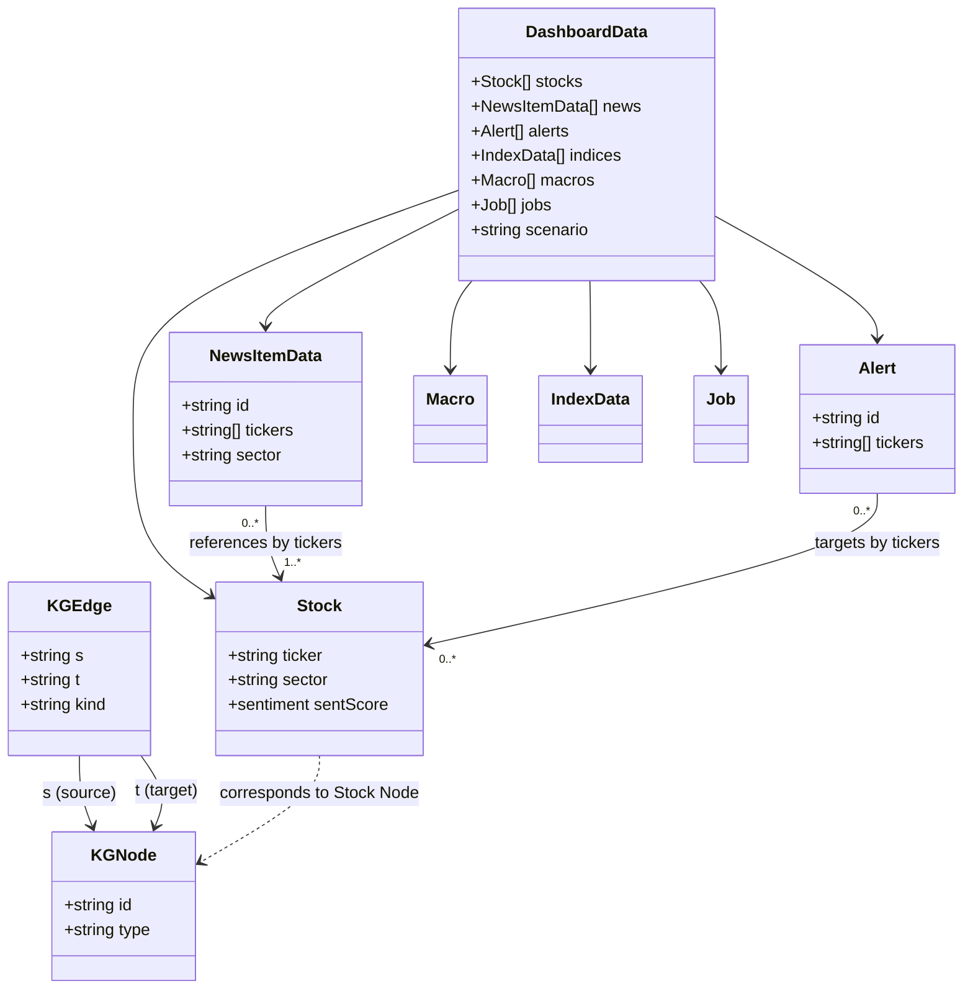

# Tài liệu Mô hình Dữ liệu (Data Models)

Tài liệu này chi tiết hóa các cấu trúc dữ liệu (interfaces) được định nghĩa trong mô-đun mô phỏng [mockData.ts](file:///Users/tunganh252/Desktop/Projects/Finance/quantyFin-ai-agent/docs/sample_src/frontend/src/lib/mockData.ts) của QuantyFin Frontend. Các mô hình này đóng vai trò là hợp đồng dữ liệu giữa UI Components và bộ dữ liệu giả lập.

## 1. Danh sách các Đối tượng Dữ liệu (Interfaces)

### 1.1. Cổ phiếu (Stock)
Mô tả thông tin chi tiết của một mã cổ phiếu bao gồm cả thông tin kỹ thuật và phân tích cảm nhận AI.
```typescript
interface Stock {
  ticker: string;         // Mã cổ phiếu (ví dụ: VCB, FPT, HPG)
  name: string;           // Tên đầy đủ của doanh nghiệp
  sector: string;         // Nhóm ngành (ví dụ: Ngân hàng, Thép, Bán lẻ)
  exchange: string;       // Sàn giao dịch (HSX, HNX, UPCoM)
  price: number;          // Giá hiện tại
  change: number;         // Mức thay đổi giá (tuyệt đối)
  changePct: number;      // Phần trăm thay đổi giá
  fiveDay: number;        // Phần trăm thay đổi trong 5 phiên gần nhất
  volume: number;         // Khối lượng giao dịch trong phiên
  series: number[];       // Chuỗi giá lịch sử dùng vẽ sparkline chart
  sentiment: 'pos' | 'neg' | 'neu'; // Chỉ số cảm nhận (Tích cực, Tiêu cực, Trung tính)
  sentScore: number;      // Điểm số cảm nhận cụ thể từ -1 đến 1
  newsCount24h: number;   // Số lượng tin tức liên quan trong 24 giờ qua
  confidence: 'high' | 'med' | 'low'; // Độ tin cậy của phân tích AI
  confidencePct: number;  // Phần trăm độ tin cậy của phân tích AI
}
```

### 1.2. Chỉ số Thị trường (IndexData)
Lưu trữ thông tin của các chỉ số thị trường chính.
```typescript
interface IndexData {
  name: string;           // Tên chỉ số (ví dụ: VN-Index, VN30, HNX-Index, UPCoM)
  value: number;          // Điểm số hiện tại của chỉ số
  change: number;         // Điểm thay đổi
  changePct: number;      // Phần trăm thay đổi điểm số
  series: number[];       // Chuỗi điểm số lịch sử phục vụ vẽ đồ thị
}
```

### 1.3. Sự kiện Vĩ mô (Macro)
Các thông tin vĩ mô và mức độ tác động của chúng đối với các nhóm ngành.
```typescript
interface Macro {
  id: string;             // Mã định danh sự kiện vĩ mô
  title: string;          // Tiêu đề sự kiện vĩ mô
  impact: 'pos' | 'neg' | 'neu'; // Hướng tác động (Tích cực, Tiêu cực, Trung tính)
  sector: string;         // Nhóm ngành chịu ảnh hưởng lớn nhất
}
```

### 1.4. Tin tức Phân tích (NewsItemData)
Các tin tức tài chính được hệ thống AI thu thập, lọc và gán điểm sentiment.
```typescript
interface NewsItemData {
  id: string;             // Mã định danh tin tức
  title: string;          // Tiêu đề bài báo
  src: string;            // Nguồn tin tức (CafeF, Vietstock, VnEconomy,...)
  url: string;            // Đường dẫn bài viết gốc
  tickers: string[];      // Danh sách các mã cổ phiếu liên quan trực tiếp
  tone: 'pos' | 'neg' | 'neu'; // Tông giọng / Cảm nhận tin tức
  sentScore: number;      // Điểm cảm nhận cụ thể
  minutesAgo: number;     // Thời gian xuất bản cách đây bao nhiêu phút
  conf: 'high' | 'med' | 'low'; // Mức độ tin cậy của AI khi gán sentiment
  confPct: number;        // Tỷ lệ phần trăm độ tin cậy
  filterStatus: 'filtered' | 'pending' | 'analyzed'; // Trạng thái xử lý tin tức của AI Pipeline
  sector: string;         // Ngành liên quan chính
}
```

### 1.5. Cảnh báo Hệ thống (Alert)
Cảnh báo thị trường bất thường hoặc rủi ro hệ thống được phát hiện từ đồ thị tri thức (Knowledge Graph).
```typescript
interface Alert {
  id: string;             // Mã định danh cảnh báo
  sev: 'high' | 'med' | 'info'; // Mức độ nghiêm trọng (Cao, Trung bình, Thông tin)
  t: string;              // Tiêu đề cảnh báo vắn tắt
  m: string;              // Chi tiết cảnh báo (ví dụ: KG path · 3 hops · 12 mã liên đới)
  tickers?: string[];     // Các mã cổ phiếu chịu ảnh hưởng trực tiếp bởi cảnh báo
  when: string;           // Thời điểm phát sinh cảnh báo
}
```

### 1.6. Tác vụ AI Thu thập (Job)
Mô tả trạng thái hoạt động của các agent thu thập dữ liệu ngầm (crawler).
```typescript
interface Job {
  id: string;             // Định danh tác vụ
  src: string;            // Tên nguồn thu thập dữ liệu (ví dụ: CafeF)
  url: string;            // RSS url hoặc endpoint cào dữ liệu
  status: 'done' | 'running' | 'retry' | 'failed'; // Trạng thái hiện tại
  total: number;          // Tổng số bài viết tìm thấy
  filteredOut: number;    // Số bài viết bị loại bỏ qua bộ lọc nhiễu
  analyzed: number;       // Số bài viết đã phân tích thành công
  durationMs: number;     // Thời gian thực hiện tác vụ (mili giây)
  traceId: string;        // Mã truy vết hệ thống
  lastRun: string;        // Thời gian chạy gần nhất
  tier: string;           // Loại công nghệ cào dữ liệu (rss, search, playwright)
}
```

### 1.7. Đồ thị Tri thức (Knowledge Graph)
Cấu trúc dùng để biểu diễn các quan hệ vĩ mô, ngành và mã cổ phiếu trong KG Viewer.
```typescript
interface KGNode {
  id: string;             // Mã định danh nút đồ thị
  type: 'Event' | 'Sector' | 'Stock' | 'Leader' | 'Macro' | 'Company'; // Kiểu nút
  label: string;          // Nhãn hiển thị trên đồ thị
  short?: string;         // Nhãn viết tắt
  size?: number;          // Kích thước hiển thị của nút dựa trên trọng số ảnh hưởng
}

interface KGEdge {
  s: string;              // Mã nút nguồn (source node ID)
  t: string;              // Mã nút đích (target node ID)
  kind: string;           // Loại mối quan hệ (BELONGS_TO, IMPACTS_POS, REDUCES,...)
  w: number;              // Trọng số mối quan hệ (từ 0 đến 1)
}
```

### 1.8. Cấu trúc Dashboard (DashboardData)
Cấu trúc tổng thể tập hợp toàn bộ dữ liệu cung cấp cho màn hình chính của ứng dụng.
```typescript
interface DashboardData {
  stocks: Stock[];        // Danh sách cổ phiếu
  news: NewsItemData[];   // Danh sách tin tức
  alerts: Alert[];        // Danh sách cảnh báo
  indices: IndexData[];   // Danh sách chỉ số thị trường
  macros: Macro[];        // Các sự kiện vĩ mô
  jobs: Job[];            // Trạng thái các tác vụ cào dữ liệu
  scenario: string;       // Kịch bản thị trường hiện tại
}
```

## 2. Quan hệ và Luồng dữ liệu (Data Relationships)


- Các mô phỏng dòng tiền hoặc tin tức vĩ mô (`Macro`, `NewsItemData`, `Alert`) được liên kết với `Stock` thông qua thuộc tính mã chứng khoán (`tickers`).
- Trình xem đồ thị tri thức (`KGViewer`) vẽ đồ thị gồm tập hợp các nút (`KGNode`) và cạnh (`KGEdge`) để biểu diễn trực quan hóa các mối liên kết chéo giữa sự kiện vĩ mô, các ngành công nghiệp và biến động giá cổ phiếu.
